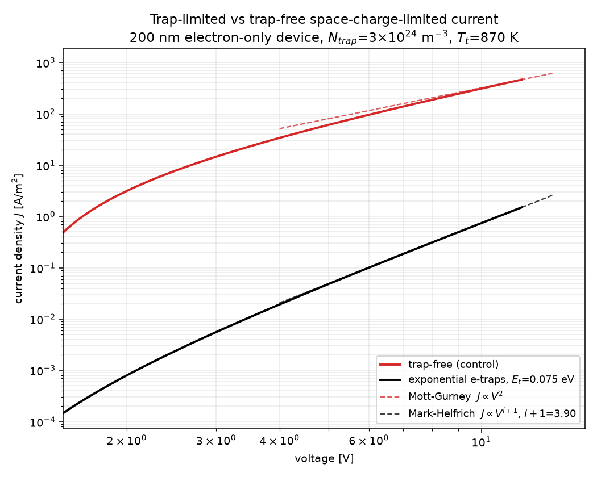

# Trap-limited current (TCLC) test

Does this simulator reproduce **trap-limited space-charge-limited current**?
Yes. This directory sets up an electron-only device with an exponential
electron-trap distribution and shows that its J–V follows the Mark–Helfrich
law, with an exponent set by the trap distribution's characteristic energy.

## The physics being tested

For a trap-free single-carrier device, SCLC obeys **Mott–Gurney**:

    J = (9/8) eps mu V^2 / L^3            ->  log-log slope = 2

With an *exponential* trap distribution of characteristic energy
`Et = kB*Tt`, the trapped charge grows as a power of the free charge and the
current becomes **trap-limited** (Mark & Helfrich):

    J  ~  V^(l+1) / L^(2l+1),      l = Tt/T = Et/(kT)

So the signature of trap-limited transport is a log-log J–V slope of
`l+1 > 2`, whose value is *predicted* by `Et`. Here

    Et = 0.075 eV = kB * 870 K,  T = 300 K  ->  l = 2.901,  slope = 3.901

## Device

Single layer, 200 nm, constant mobility (no field or density dependence, so
nothing else contributes a voltage dependence to the slope).

| | |
|---|---|
| Cathode | `ohmic-np`, `np = Nc = 1e25 m^-3` — **zero** electron barrier |
| Anode | `ohmic-barrier`, **1.0 eV** hole barrier |
| Traps | exponential, **electrons only** (`trap_model_h = none`) |
| `Ntrap` | 3e24 m^-3 integrated (`trap_Nt_e` = 4.0e25 m^-3 eV^-1 prefactor) |
| Recombination | Langevin |
| `mun` | 1e-9 m^2/Vs |

The 1.0 eV hole barrier makes this genuinely electron-only: the simulation
gives `p/n ~ 1e-13`, so the current is carried by electrons and the
Mark–Helfrich single-carrier analysis applies. Langevin recombination is on
as requested; with `p` that small the bimolecular term is numerically
irrelevant to J, but it is the physically correct model for the device.

Note `trap_Nt_e` is the tail **prefactor** in m^-3 eV^-1 (`dos.c:trap_rho`
returns `Nt*exp(E/Et)`); the integrated density is `Nt*Et`.

## Files

| File | |
|---|---|
| `tlc_traps.ini` | the trap-limited device |
| `tlc_trapfree.ini` | identical device, traps off — the slope-2 control |
| `verify_tclc.py` | runs both decks and checks the three TCLC signatures |
| `plot_tclc.py` | log-log J–V with both power laws overlaid |
| `tclc_jv.png` | the resulting figure |

The two decks differ **only** in `trap_model_e` and `output_dir`
(`diff` them), so the comparison is properly controlled.

```bash
python3 tests/trap_limited/verify_tclc.py            # 2 runs
python3 tests/trap_limited/verify_tclc.py --scan-et  # + the Et sweep
```

## Results — all checks pass

**1. Trap-free control obeys Mott–Gurney.** Fitted slope (V > 5 V) =
**2.296**, and `J/J_MG` = 0.66→0.86, rising toward 1. Both the excess slope
and the deficit in J are the expected built-in-potential correction: the
asymmetric contacts create a Vbi that eats part of the applied bias, so the
device approaches the ideal law from below as V grows.

**2. The trapped device is trap-limited.** Fitted slope = **3.913** against
the predicted 3.901 — a **0.30%** error — and the current is suppressed
**309×** relative to the trap-free control at 12 V.

**3. The exponent tracks `Et`.** This is the decisive test: an arbitrary
steep J–V would not move correctly when the trap distribution is changed.

| Et [eV] | Tt [K] | predicted `l+1` | measured | error |
|---|---|---|---|---|
| 0.050 | 580 | 2.934 | 3.073 | +4.7% |
| 0.060 | 696 | 3.321 | 3.435 | +3.4% |
| 0.075 | 870 | 3.901 | 3.954 | +1.4% |
| 0.090 | 1044 | 4.481 | 4.443 | −0.9% |
| 0.105 | 1218 | 5.062 | 4.909 | −3.0% |

The measured exponent follows `l+1 = Et/kT + 1` over a 2.6× range of trap
temperature, worst-case 4.7%. The residual drift (slightly over-steep at
small `Et`, slightly under-steep at large `Et`) is expected — Mark–Helfrich
is an asymptotic zero-diffusion result, while the simulation includes
diffusion and a finite built-in potential.

**Trap filling.** `theta = n_free/n_trapped` = 0.159 → 0.070 from 2 V to
12 V: only ~7% of the charge is mobile, and theta *falls* with bias, so the
traps are not filling over the sweep.

## Choosing the trap density

`Ntrap` was not arbitrary — the TCLC window is bounded on both sides, and
this was scanned:

| `Ntrap` [m^-3] | measured slope |
|---|---|
| 1e23 | 2.58 |
| 3e23 | 3.14 |
| 1e24 | 3.89 |
| **3e24** | **3.91** ← used |
| 1e25 | 3.59 |
| 3e25 | 3.06 |

Too **few** traps and they fill as the bias rises, `theta -> 1`, and the
device reverts to trap-free Mott–Gurney. Too **many** and the trap
quasi-Fermi level is pinned so deep in the tail that it leaves the
exponential region the derivation assumes, and the slope falls back toward 2
again. 3e24 m^-3 sits at the centre of the plateau.


